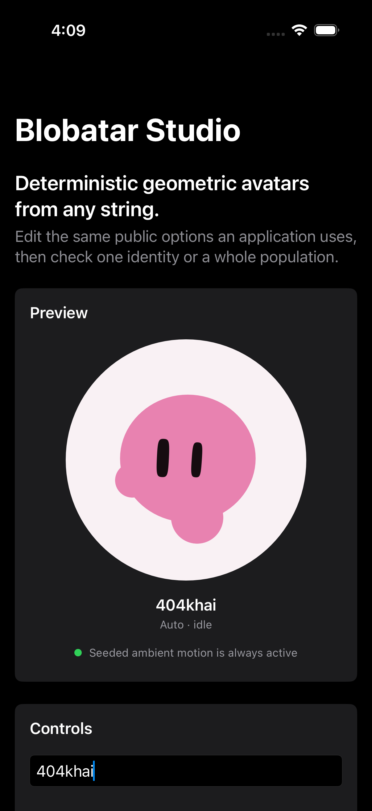

# Blobatar for Swift and SwiftUI

Deterministic geometric blobatars from any string. This is the native Swift
port of [Blobatar](https://blobatar.dev), maintained in the upstream monorepo
with the same frozen generation-2 seed-to-look contract as the TypeScript and
Dart implementations.

The same name and options produce the same figure. The port resolves geometry
in pure Swift and paints native SwiftUI `Canvas` paths; it does not execute
JavaScript, parse generated SVG, or embed a web view.



## Installation

In Xcode, choose **File > Add Package Dependencies** and enter:

```text
https://github.com/Alain00/blobatar.git
```

Select version `2.8.0` or later within major version 2, then add
`BlobatarSwiftUI` to an application target. For a manifest-based package:

```swift
dependencies: [
  .package(
    url: "https://github.com/Alain00/blobatar.git",
    from: "2.8.0"
  )
]
```

The repository exposes two products:

| Product           | Purpose                                                                                                 |
| ----------------- | ------------------------------------------------------------------------------------------------------- |
| `BlobatarCore`    | UI-independent normalization, hashing, traits, palette, geometry, expressions, and elapsed-time motion. |
| `BlobatarSwiftUI` | Static and animated SwiftUI views. Depends on and imports `BlobatarCore`.                               |

## Static SwiftUI view

```swift
import BlobatarCore
import BlobatarSwiftUI

Blobatar(
  name: user.email,
  size: 72,
  options: BlobatarOptions(
    background: .squircle,
    expression: .happy
  ),
  accessibilityLabel: "Avatar of \(user.displayName)"
)
```

`size` pins a square edge. When it is omitted, the view expands to the space
offered by its parent and fits the generation-2 100-by-100 drawing into the
largest centered square. The whole drawing is one accessibility image. An
omitted `accessibilityLabel` deliberately stays unlabeled rather than speaking
the private name used to generate it.

## Animated SwiftUI view

```swift
AnimatedBlobatar(
  name: user.email,
  size: 120,
  options: BlobatarOptions(expression: .thinking),
  animation: .always,
  active: isOnScreen,
  accessibilityLabel: "Avatar of \(user.displayName)"
)
```

`.always` runs seeded breathe, bob, blink, and saccade motion continuously.
`.hover` ramps ambient motion and lift in while a pointer is over the view. Set
`active: false` when an application knows that a list row is off-screen. The
view also stops its timeline in an inactive scene and, by default, when Reduce
Motion is enabled. Set `respectsReducedMotion: false` only when the application
provides an equivalent accessibility control.

Expression changes morph with the upstream timing and easing. Identity and
geometry changes cut to the new resolved figure; they never interpolate two
unrelated silhouettes or regenerate geometry on each animation frame.

## Options

`BlobatarOptions` is immutable and forwarded to the core without
SwiftUI-specific defaults:

```swift
let options = BlobatarOptions(
  palette: BlobatarPaletteOverride(eye: "#ffffff"),
  hue: 210,
  tone: 0.8,
  traits: [
    "shape": .pinned(0.99),
    "eye.gap": .narrowed([0.1, 0.9]),
  ],
  normalize: true,
  contrast: true,
  background: .circle,
  expression: .love
)
```

| Option       | Swift value                                | Behavior                                                                                          |
| ------------ | ------------------------------------------ | ------------------------------------------------------------------------------------------------- |
| `background` | `.none`, `.squircle`, `.circle`, `.square` | Draws the selected backdrop plate.                                                                |
| `hue`        | `Double?` in degrees                       | Pins color while the name continues to drive other traits.                                        |
| `tone`       | `Double?` in `0..<1`                       | Selects an authored lightness and chroma band.                                                    |
| `palette`    | `BlobatarPaletteOverride?`                 | Replaces selected background, head, or eye colors verbatim.                                       |
| `traits`     | `[String: BlobatarTraitOverride]`          | Pins or narrows hash-space trait positions; omitted traits stay name-driven.                      |
| `normalize`  | `Bool`                                     | Applies NFC normalization, trimming, and lowercase when true.                                     |
| `contrast`   | `Bool`                                     | Enforces generated-palette contrast floors when true. Explicit palette overrides remain verbatim. |
| `expression` | `BlobatarExpression?`                      | Applies one of the fourteen generation-2 poses and optional tint.                                 |

The expression roster is `idle`, `happy`, `sad`, `mad`, `surprised`, `wink`,
`sleepy`, `smug`, `unsure`, `scared`, `love`, `shy`, `sick`, and `thinking`.
Omitting an expression is exactly equivalent to `.idle`.

## Core API

Renderers and tools that do not use SwiftUI can resolve immutable drawing data
directly:

```swift
import BlobatarCore

let drawing = resolveBlobatar(
  "alain@example.com",
  options: BlobatarOptions(
    traits: ["shape": .narrowed([0.11, 0.965])],
    background: .squircle
  )
)

let seeds = resolveBlobatarMotion("alain@example.com")
let frame = blobatarMotionFrame(
  seeds: seeds,
  elapsedMilliseconds: 1_200,
  amplitude: 1
)
```

`resolveBlobatar` is the core module's deep seam. Hash implementation details,
numeric trait ranges, silhouette composition, palette correction, and
containment remain private. `BlobatarAnimationModel` exposes the same pure
elapsed-time transforms used by `AnimatedBlobatar`; callers supply one shared
monotonic millisecond clock and should not accumulate frame deltas.

## Parity

The port is pinned to Blobatar `2.4.0`, generation 2. Later 2.x releases add
capabilities without changing that generation's seed-to-look mapping. The
canonical fixture at
[`../../fixtures/blobatar-v2.4.0.json`](../../fixtures/blobatar-v2.4.0.json)
was exported from TypeScript and is read-only to the Swift tests.

| Area                              | Status       | Evidence or boundary                                                                                      |
| --------------------------------- | ------------ | --------------------------------------------------------------------------------------------------------- |
| NFC, trim, and lowercase          | Supported    | International vectors cover composed/decomposed Latin, mixed case, CJK, emoji, Greek, and Arabic.         |
| Hash and keyed trait streams      | Exact        | Unsigned states and stream values compare directly with TypeScript vectors.                               |
| Ten generation-2 silhouettes      | Supported    | Structured path commands match and containment is swept over thousands of names and overrides.            |
| OKLCh palette and contrast        | Supported    | Rounded hexadecimal colors match across hue, tone, and override vectors.                                  |
| Four backdrops                    | Supported    | Core ordering and SwiftUI raster tests cover every plate.                                                 |
| Fourteen expressions              | Supported    | Pose channels, tint endpoints, asymmetry, and extreme geometry are covered.                               |
| Breathe, bob, blink, and saccades | Supported    | Seeded periods, phases, wrap, easing, and fixed elapsed frames match TypeScript calculations.             |
| Hover and always motion           | Supported    | Driver and hosted-view tests cover activation, interruption, scene state, Reduce Motion, and reuse.       |
| Pointer gaze API                  | Not included | Gaze was added after the pinned contract and remains an optional post-release interaction layer.         |
| SVG and string output             | Not included | SwiftUI paints native paths; use the TypeScript package when serialized SVG or a data URI is required.    |

### Known differences and boundaries

- Swift and JavaScript can lowercase uncommon Unicode scalars differently even
  when NFC normalization agrees. The checked-in international vectors define
  the supported cross-runtime result; extending normalization requires new
  upstream vectors.
- IEEE 754 does not prescribe one bit-exact trigonometric implementation.
  Trigonometric layout values use the fixture's narrow `1e-9` relative
  tolerance. Hashes, traits, rounded path strings, colors, and expression
  channels remain exact.
- Core Graphics and browser SVG engines antialias vector edges differently.
  Geometry, transform order, colors, and draw order match; individual edge
  pixels are not a cross-platform contract.
- Hover is meaningful only when a pointer exists. Use `.always` for touch-first
  presentation and let `active` express application visibility.
- Interactive pointer gaze is not part of this release. The existing seeded
  `gaze.x` and `gaze.y` traits only place the generated eyes at rest; they are
  not a live gaze controller.

## Supported platforms

| Platform                | Minimum      | Static | Animated | Notes                                                                    |
| ----------------------- | ------------ | ------ | -------- | ------------------------------------------------------------------------ |
| iOS and iPadOS          | 15           | Yes    | Yes      | `.always` works on touch; `.hover` activates only with pointer hover.    |
| macOS                   | 12           | Yes    | Yes      | Supports both `.hover` and `.always`.                                    |
| tvOS, watchOS, visionOS | Not declared | No     | No       | Deferred until each native interaction and rendering contract is tested. |

The package requires Swift 6. CI checks Xcode 16 as the minimum toolchain and
the latest stable Xcode, including macOS and generic iOS builds.

## Blobatar Studio

The integration example lives in
[`Examples/BlobatarStudio`](Examples/BlobatarStudio). It exercises every public
option, pinned and narrowed traits, static and animated modes, Reduce Motion,
all silhouettes, varied backdrops and expressions, and the example-only Easter
eggs.

```sh
# macOS
swift run --package-path packages/swift/Examples/BlobatarStudio BlobatarStudio

# tests
swift test --package-path packages/swift/Examples/BlobatarStudio
```

Open `Examples/BlobatarStudio/BlobatarStudio.xcodeproj` and select an iOS
simulator to run the iOS app.

## Development

From the repository root:

```sh
swift build --build-tests -Xswiftc -warnings-as-errors
swift test -Xswiftc -warnings-as-errors
swift run --package-path packages/swift/Tests/Consumer BlobatarConsumerSmoke
swift test --package-path packages/swift/Examples/BlobatarStudio -Xswiftc -warnings-as-errors
```

The consumer smoke package is deliberately separate and imports only the two
public products through the repository's root manifest. The DocC catalogs can
be built in Xcode with **Product > Build Documentation**.

Blobatar is available under the [MIT license](LICENSE).
